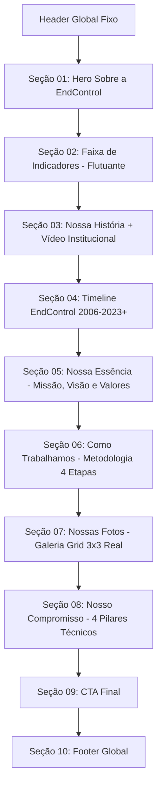

# Plano de Implementação — Nova Página Sobre Nós (EndControl Engenharia)

Implementação da nova página institucional **Sobre Nós** da **EndControl Engenharia**, perfeitamente integrada à identidade visual, tokens de design, componentes globais (Header e Footer) e acervo fotográfico real do projeto.

---

## 1. Diagnóstico do Projeto Existente

### Stack e Arquitetura
- **Base Técnica:** HTML5 semântico, Vanilla CSS modular com variáveis nativas (`tokens.css`), Vanilla JavaScript moderno e Lucide Icons (CDN + SVGs otimizados).
- **Tipografia:** Google Fonts: `Inter` (família principal sans-serif), `Roboto Condensed`, `Arimo` e `JetBrains Mono`.
- **Paleta de Cores e Tokens Oficiais (`src/css/tokens.css`):**
  - Fundo & Superfícies Escuras: `--color-bg-primary` (`#071429`), `--color-bg-secondary` (`#0A1B33`), `--color-bg-deep` (`#020B18`).
  - Acentos da Marca: `--color-primary` (`#009CFF`), `--color-primary-strong` (`#007BFF`), `--color-primary-light` (`#18B7FF`), `--color-cyan` (`#00C2FF`).
  - Textos & Neutros: `--color-text-primary` (`#F5F7FB`), `--color-text-secondary` (`#C7D0DE`), `--color-text-muted` (`#8FA3BC`).
  - Bordas & Glassmorphism: `--color-border-blue` (`rgba(0, 156, 255, 0.35)`), `--color-card-bg` (`rgba(7, 20, 41, 0.78)`), `--glass-surface`, `--glass-border-glow`.
- **Componentes Globais Reutilizáveis:**
  - Header fixo com efeito de blur no scroll e dropdowns multinível (`.site-header`, `.main-menu`, `.dropdown-rich-menu`).
  - Botões do Design System: `.btn.primary` (sólido azul) e `.btn.secondary` (outline ciano com glow neon).
  - Footer oficial com 3 colunas com divisores verticais de glow, logo central, redes sociais e dados de contato.
  - Modais institucionais e overlays de vídeo.
- **Acervo Fotográfico Identificado:**
  - Fotografias operacionais reais de alta qualidade em `assets/Fotografias/originais-16-9/` (ensaios de ultrassom phased array, calibração, inspeção de bombas, reuniões técnicas, técnicos em refinaria, alpinismo industrial).
  - Imagens setoriais em `assets/Paginas Imgs/HOME/S_SEGMENTOS/` e `assets/Paginas Imgs/HOME/CARDS-AREAS-ATUACAO/`.
  - Logotipos vetorizados e webp em `assets/Logos/`.

---

## 2. Arquivos Envolvidos

### Arquivos Novos a Criar
1. `sobre-nos.html` — Estrutura HTML semântica completa da página Sobre Nós.
2. `src/css/sobre-nos.css` — Estilos exclusivos e modulares da página Sobre Nós, utilizando os tokens globais sem duplicar o Design System.
3. `src/js/sobre-nos.js` — Interatividade leve: controle de play/modal de vídeo, navegação e animação da timeline, lightbox para a galeria 3x3 e animações de entrada via `IntersectionObserver`.

### Arquivo a Atualizar
1. `index.html` — Conectar o item de menu "Sobre Nós" (`#menu-link-sobre`) para apontar para `sobre-nos.html`.

---

## 3. Elementos Reaproveitados da Home

| Componente / Recurso | Origem | Como será reaproveitado |
| :--- | :--- | :--- |
| **Design Tokens & Variáveis** | `src/css/tokens.css` | Importado diretamente para manter paleta, tipografia, raios e sombras idênticos. |
| **Estilos Base & Reset** | `src/css/base.css` | Tipografia, `.container`, utilitários de acessibilidade e classes de botões. |
| **Header Global** | `src/css/header.css` | Mesma estrutura HTML e comportamento, com link "Sobre Nós" no estado ativo. |
| **Footer Global** | `src/css/work-units-footer.css` | Mesma estrutura de 3 colunas com divisores luminosos, logo central e contato. |
| **Modais & Utilitários** | `src/css/components.css` | Modal overlay e scripts de fallback de carregamento de imagens/vídeos. |

---

## 4. Detalhamento de Cada Seção

### Seção 01 — Hero / Sobre a EndControl
- **Composição:** Centralizada, elegante e compacta.
- **Elementos:** Tag superior `—— SOBRE A ——` com linhas ciano, logotipo vertical centralizado `assets/Logos/logo-endcontrol-vertical-negativo.webp`, fundo escuro industrial com máscara de profundidade azul profundo.

### Seção 02 — Indicadores
- **Composição:** Card flutuante branco com cantos arredondados (24px) e sombra suave com glow azul, sobrepondo Hero e História.
- **Conteúdo:** 5 métricas com ícones lineares azuis e separadores verticais:
  1. `+18 anos` — de experiência
  2. `+300` — projetos realizados
  3. `+1.250` — ativos avaliados
  4. `100%` — compromisso com segurança
  5. `+120` — clientes atendidos

### Seção 03 — Nossa História
- **Composição:** Fundo claro com textura sutil de grid/pontos técnicos.
- **Headline:** *Uma trajetória construída com **propósito e proximidade**.*
- **Texto:** Breve contextualização institucional.
- **Frame de Vídeo:** Proporção 16:9 com fotografia de refinaria iluminada, overlay sutil, botão Play central iluminado e texto *ASSISTA AO VÍDEO INSTITUCIONAL*.

### Seção 04 — Timeline EndControl
- **Composição:** Card técnico integrado com borda azul suave.
- **Marcos:** Linha contínua com nós brilhantes:
  - `2006` — Início da Jornada (Fundação com foco em inspeções e serviços técnicos)
  - `2010` — Expansão Técnica (Ampliação do portfólio de serviços e equipes)
  - `2014` — Novas Tecnologias (Investimento em inovação e diagnósticos de alta precisão)
  - `2018` — Atuação Nacional (Consolidação em múltiplos estados e segmentos)
  - `2023+` — O Futuro (Novos capítulos e compromisso com próximas gerações)

### Seção 05 — Nossa Essência
- **Composição:** Fundo escuro azul-profundo (`--color-bg-deep`) com grafismo radial técnico.
- **Headline:** *Princípios que orientam cada **decisão**.*
- **3 Blocos Técnicos:** Cards escuros com bordas glow ciano, acabamento de circuitos nos cantos e ícones circulares:
  - **MISSÃO:** Soluções de engenharia e integridade com segurança, qualidade e eficiência.
  - **VISÃO:** Referência nacional em integridade de ativos e inovação.
  - **VALORES:** 7 pilares em lista com marcadores luminosos (Segurança, Ética, Excelência, Pessoas, Inovação, Resultados, Compromisso).

### Seção 06 — Como Trabalhamos (Metodologia)
- **Composição:** 2 colunas assimétricas.
  - **Esquerda:** Tag `COMO TRABALHAMOS`, headline *Método, conhecimento e precisão em **cada etapa**.*, descrição e botão `.btn-secondary` ("Conheça nossas soluções"). Foto de engenheiro com tablet integrada no rodapé esquerdo.
  - **Direita:** Fluxo de 4 passos com números ciano, badges circulares com ícones e setas conectoras:
    - `01` — Entendimento do desafio
    - `02` — Planejamento técnico
    - `03` — Execução em campo
    - `04` — Análise e resultado

### Seção 07 — Nossas Fotos (Galeria)
- **Composição:** Fundo claro com matriz de pontos decorativos.
- **Headline:** *Momentos que mostram quem **somos** e o que **fazemos**.*
- **Grid 3x3:** 9 fotografias operacionais reais selecionadas dos assets da EndControl:
  1. Inspeção com ultrassom em casco e estrutura (`operacional-inspecao-ultrassom-casco-estrutura-edit.webp`)
  2. Engenheiros em campo com sistema Raptor Scan (`ultrassom-raptor-scan-tecnicos-reunidos-campo-edit.webp`)
  3. Diagnóstico e medição de equipamentos industriais (`operacional-engenheiros-inspecao-bomba-edit.webp`)
  4. Inspeção interna em vaso/solda com EPI completo (`operacional-ultrassom-solda-tubulacao-edit-final.webp`)
  5. Alpinismo industrial em vaso de pressão (`operacional-alpinismo-inspecao-vaso-pressao-edit.webp`)
  6. Crawler de inspeção de ultrassom em operação (`ultrassom-raptor-scan-crawler-operacao-edit.webp`)
  7. Alpinismo industrial em escada de tanque (`operacional-alpinismo-industrial-escada-tanque-edit.webp`)
  8. Engenheiros avaliando integridade de bomba industrial (`operacional-engenheiros-inspecao-bomba-edit.webp`)
- **Tratamento:** Bordas arredondadas (16px), `object-fit: cover`, hover suave com leve zoom e abertura em Lightbox interativo.

### Seção 08 — Nosso Compromisso
- **Composição:** Fundo escuro com foto de dois técnicos EndControl com tablet à direita.
- **Headline:** *Excelência técnica começa com **responsabilidade**.*
- **4 Pilares:** Mini-cards translúcidos com borda inferior glow:
  - **Segurança:** Proteção de pessoas e operações.
  - **Confiabilidade:** Decisões sustentadas por método.
  - **Evolução:** Tecnologia e capacitação contínua.
  - **Pessoas:** Conhecimento técnico e comprometimento.

### Seção 09 — CTA Final
- **Composição:** Faixa industrial escura com atmosfera técnica.
- **Headline:** *Grandes operações exigem parceiros em quem se pode **confiar**.*
- **CTAs:** Dois botões lado a lado: "Conheça nossas soluções" (azul sólido) e "Fale com um especialista" (outline ciano).

### Seção 10 — Footer
- Reutilização exata da estrutura de 3 colunas e dados oficiais do rodapé da Home.

---

## 5. Estratégia de Responsividade

| Componente | Desktop (≥ 1200px) | Tablet (768px - 1199px) | Mobile (≤ 767px) |
| :--- | :--- | :--- | :--- |
| **Indicadores** | Linha única de 5 colunas com divisores | Grid 3 + 2 ou 2x3 | Grid de 2 colunas / stack com espaçamento otimizado |
| **Timeline** | Linha horizontal de 5 marcos | Linha horizontal com scroll suave | Linha vertical conectada com pontos laterais |
| **Essência (Missão/Visão/Valores)** | Grid 3 colunas | Grid 2 + 1 ou coluna única | 3 cards empilhados verticalmente |
| **Como Trabalhamos** | 2 colunas (Texto + 4 passos horizontais) | 2 colunas com passos em grid 2x2 | Stack vertical com setas apontando para baixo |
| **Galeria de Fotos** | Grid 3x3 (9 fotos) | Grid 2x4 + 1 ou 3 colunas | Grid de 1 ou 2 colunas |
| **Compromisso** | Grid de 4 cards integrados à foto | Grid 2x2 com foto ao fundo | 4 cards em coluna única sobre a imagem escurecida |
| **CTA Final** | Centralizado com 2 botões inline | Centralizado com 2 botões inline | Botões empilhados 100% largura |

---

## 6. Plano de Verificação

### Verificação Manual e Visual
- Validar a fidelidade visual comparando tela a tela com `assets/Paginas Imgs/SOBRE NOS/REF/SOBRENOS-FULL-PAGE.png` e imagens de seções em `REF/secoes/`.
- Testar a responsividade em resoluções `1920px`, `1440px`, `1024px`, `768px`, `430px`, `390px` e `375px`.
- Verificar navegação bidirecional: Menu "Sobre Nós" na Home leva a `sobre-nos.html`, e "Home" / "Nossas Soluções" em `sobre-nos.html` leva de volta a `index.html`.
- Confirmar que `index.html` permanece 100% intacta e sem alterações visuais indesejadas.
